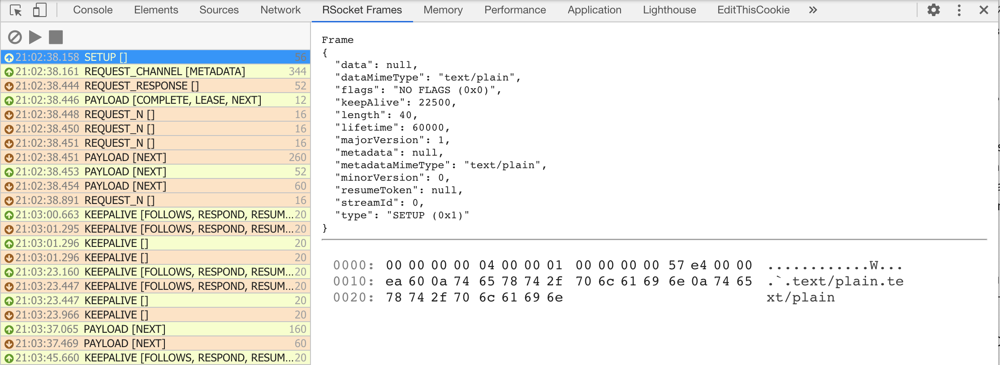

# RSocket Chrome Dev Tools

A set of devtools to support developments of RSoscket-based application in Chrome. 

## RSocket Frame Viewer

RSockets allows for viewing RSocket frames sent over a WebSocket connection. Data or Metadata of the frames encoded in json can also be viewed in the object inspector view. 



## Install

You can get install from the extension from the [Chrome Web Store](https://chromewebstore.google.com/detail/rsocket-frame-inspector/ngahaeldlnilenncggaldohkbbenhedl). 

Alternatively, the extension can be built from source and then installed manually. 

```bash
yarn install && yarn build
```

## Contribute

Contributions are always welcome!
